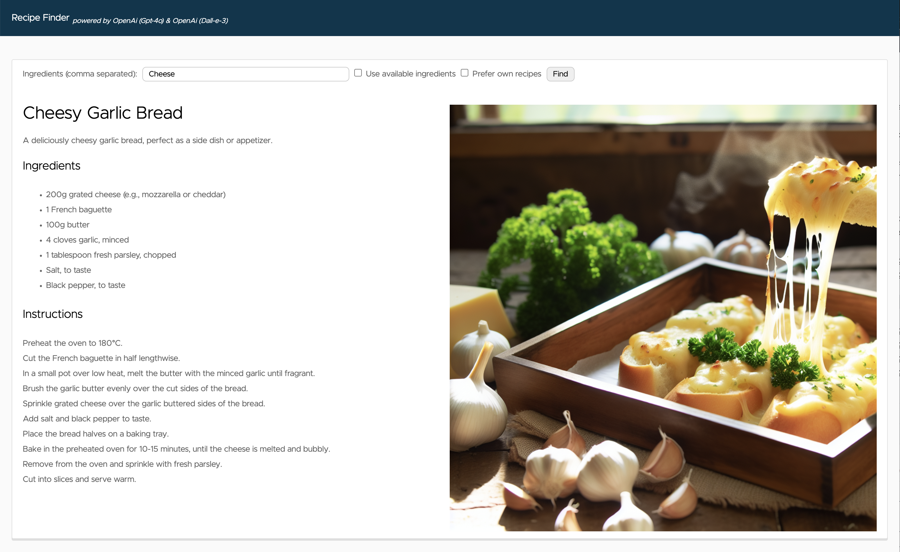
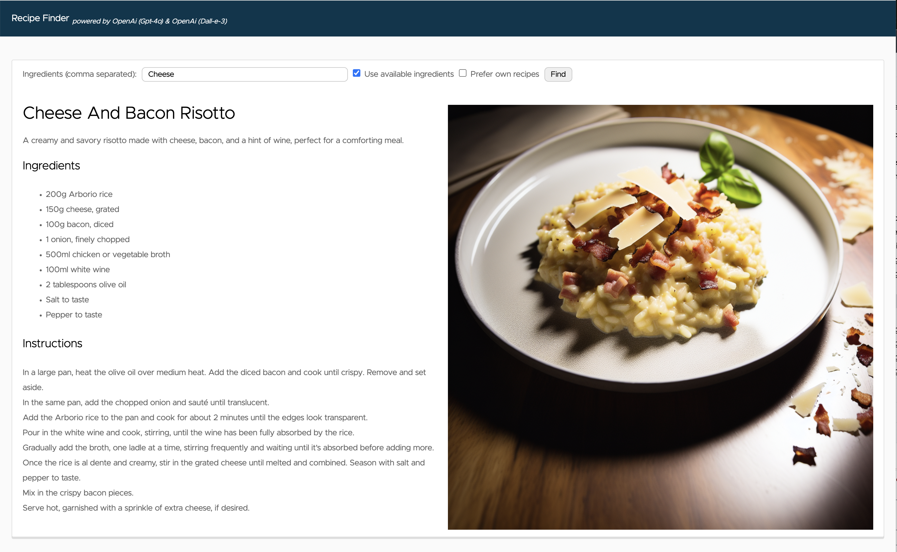
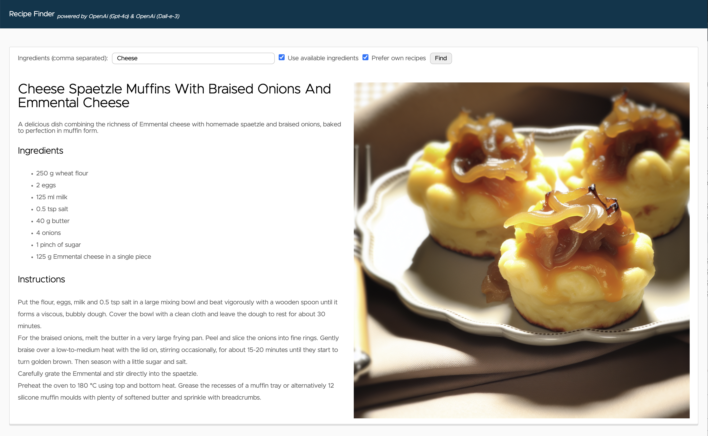

# AI Recipe Finder

Demo on how easy it is to build AI-driven applications with Spring Boot and different Java AI frameworks. 
It also shows how to implement advanced techniques for the adaption of foundation models with Function Calling and RAG.

AI framework implementations:
- [LangChain4J](langchain4j)
- [Semantic Kernel](semantic-kernel)
- [Spring AI (external)](https://github.com/timosalm/spring-ai-recipe-finder)
- [Spring AI MCP (external)](https://github.com/timosalm/spring-ai-recipe-finder-mcp)



# Setup
## LLM
### Local LLM (Ollama)
As Ollama doesn't yet provide a text-to-image model, recipe image generation is not available with this setup. 
From version 3.1 Llama is supporting Function Calling even if it's not working well with the small models.

#### Option 1
1. Download and install Ollama on your local machine [link](https://ollama.com/)
2. Start llama3.1 model (Ollama 0.2.8 or newer, and Llama 3.1 or newer is required for Function Calling)
    ```
    ollama run llama3.1
    ```
#### Option 2
By enabling the "ollama-compose" Spring profile, the llama3.1 model will be automatically started and configured with docker compose.
Depending on your system (e.g. ARM macs) this is not a recommended setup due to performance reasons.
```
export SPRING_PROFILES_ACTIVE=ollama,ollama-compose
```
### OpenAI
Set the API key via an environment variable or in [application-openai.yaml](src/main/resources/application-openai.yaml).
```
export OPENAI_KEY=<INSERT KEY HERE>
```
Run your application with the "openai" Spring Profile.
```
export SPRING_PROFILES_ACTIVE=openai
```

### Azure OpenAI
Set the API key and endpoint via environment variables or in [application-azure.yaml](src/main/resources/application-azure.yaml).
```
export AZURE_OPENAI_API_KEY=<INSERT KEY HERE>
export AZURE_OPENAI_ENDPOINT=https://{your-resource-name}.openai.azure.com
```

Make sure the deployment names of the models match exactly what's in your [application-azure.yaml](src/main/resources/application-azure.yaml) configuration file.

Currently, [**only some regions support image generation** with Dall-E](https://learn.microsoft.com/en-us/azure/ai-services/openai/concepts/models#dall-e-models).
If you use a region that doesn't support it, you have to disable the image generation by setting `ai.azure.openai.image.enabled: false` in the [application-azure.yaml](src/main/resources/application-azure.yaml) configuration file to not run into errors.

Run your application with the "azure" Spring Profile.
```
export SPRING_PROFILES_ACTIVE=azure
```

### Vector DB
On your local machine, a Redis database is automatically started and configured with docker compose. 

# Running the application locally
```
./gradlew bootRun
```
Open [http://localhost:8080](http://localhost:8080) in your browser. 
Enter the ingredients (e.g. "Cheese") you want to find a recipe for in the form and press the "find" button.

## Tool Calling 
By checking the "Prefer available ingredients" checkbox, Tool Calling will be enabled.
As the functionality the API call to check the available ingredients in the fridge are not yet implemented, they can be configured via the
`app.available-ingredients-in-fridge` property in [application.yaml](src/main/resources/application.yaml).

Bacon and onions are currently configured for available ingredients in fridge.
With the input "Cheese", you should get a recipe with cheese and bacon.


## Retrieval-Augmented Generation(RAG)
By checking the "Prefer own recipes" checkbox, Retrieval-Augmented Generation will be enabled.

To upload your own PDF documents for recipes to the vector database, there is a REST API endpoint implemented. 
```
curl -XPOST -F "file=@$PWD/german_recipes.pdf" -F "pageBottomMargin=50" http://localhost:8080/api/v1/recipes/upload
```
Based on the sample recipes part of this repository, with the input "Cheese", you should get a recipe that goes in the direction of a cheese spaetzle muffin.
